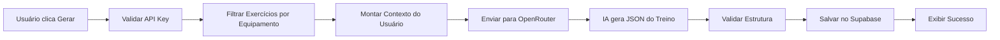

# 🤖 Personal Trainer IA - Geração Automática de Treinos

Sistema de geração inteligente de treinos usando OpenRouter AI.

## ✨ Funcionalidades

- **Geração com IA**: Personal Trainer virtual que analisa seu perfil e cria treinos personalizados
- **Treino Único**: Gere um treino completo baseado no seu objetivo e nível
- **Semana Completa**: Gere automaticamente vários treinos para a semana inteira
- **Personalização Total**: Considera seu objetivo, nível, equipamentos, lesões e preferências
- **Modo Manual**: Opção de criar treinos manualmente caso prefira

## 🚀 Setup - OpenRouter API

### 1. Criar Conta no OpenRouter

1. Acesse: https://openrouter.ai/
2. Faça login ou crie uma conta
3. Vá em: https://openrouter.ai/keys
4. Clique em "Create Key"
5. Copie sua API key

### 2. Configurar API Key

1. Abra o arquivo `.env.local` na raiz do projeto
2. Substitua `your-openrouter-api-key-here` pela sua chave real:

```env
VITE_OPENROUTER_API_KEY=sk-or-v1-xxxxxxxxxxxxxxxxxxxxx
```

3. **IMPORTANTE**: Reinicie o servidor de desenvolvimento:

```bash
# Pare o servidor (Ctrl+C) e inicie novamente
npm run dev
```

### 3. Verificar Configuração

- Se a API key não estiver configurada, você verá um alerta explicando como configurar
- Após configurar corretamente, o botão "Gerar com IA" funcionará normalmente

## 💡 Como Usar

### Criar Treino com IA

1. Vá em **Treinos** → **Criar Treino**
2. Selecione **"Gerar com IA"** (modo padrão)
3. Escolha o tipo de geração:
   - **Treino Único**: Gera 1 treino personalizado
   - **Semana Completa**: Gera múltiplos treinos (baseado na sua frequência semanal)
4. Revise seus dados de perfil exibidos
5. Clique em **"Gerar Treino com IA"** ou **"Gerar X Treinos"**
6. Aguarde a geração (15-30 segundos)
7. Treino(s) criado(s) com sucesso! 🎉

### Criar Treino Manual

1. Vá em **Treinos** → **Criar Treino**
2. Selecione **"Criar Manualmente"**
3. Preencha informações básicas (nome, descrição, categoria, dificuldade)
4. Adicione exercícios um por um
5. Configure séries, repetições e descanso
6. Salve o treino

## 🎯 O que a IA Considera

A IA Personal Trainer analisa seu perfil completo:

- **Objetivo**: Perda de peso, ganho muscular, condicionamento, etc.
- **Nível**: Iniciante, intermediário ou avançado
- **Frequência**: Quantos dias por semana você treina
- **Equipamentos**: Peso corporal, halteres, barras, máquinas, etc.
- **Horário**: Preferência de treino (manhã, tarde, noite)
- **Lesões/Restrições**: Evita exercícios que possam agravar lesões
- **Dados Físicos**: Idade e gênero para personalizar intensidade

## 📊 Modelo de IA

O sistema usa o **Claude 3.5 Sonnet** da Anthropic via OpenRouter:
- Modelo mais avançado para geração de treinos
- Entende contexto complexo de fitness
- Segue diretrizes de segurança e eficiência
- Ajusta volume/intensidade automaticamente

## 🔧 Arquitetura Técnica

### Arquivos Criados

1. **`src/services/aiWorkoutGenerator.js`**
   - Serviço principal de geração de treinos
   - Integração com OpenRouter API
   - Personal Trainer system prompt
   - Funções: `generateWorkout()`, `generateWeeklyWorkouts()`, `isAIConfigured()`

2. **`src/pages/Workouts/WorkoutCreatePage.jsx`** (atualizado)
   - Toggle entre modo IA e manual
   - UI de geração com single/batch
   - Exibição de contexto do usuário
   - Progress indicators

3. **`src/pages/Workouts/Workouts.css`** (atualizado)
   - Estilos para mode selector
   - Estilos para AI generation section
   - Option cards e user context
   - Animações e loading states

### Fluxo de Geração



### Personal Trainer System Prompt

O prompt define:
- Personalidade: Personal Trainer experiente e certificado
- Diretrizes de segurança e eficiência
- Regras de volume por nível
- Formato de resposta (JSON estrito)
- Considerações de lesões e restrições

## 💰 Custos

OpenRouter cobra por uso:
- **Claude 3.5 Sonnet**: ~$0.003 - $0.015 por geração
- **Treino único**: ~$0.01
- **Semana completa (3 treinos)**: ~$0.03
- **100 treinos**: ~$1.00

Crédito grátis inicial: $5 (suficiente para ~500 treinos)

## 🐛 Troubleshooting

### "OpenRouter API não configurada"
- Verifique se adicionou a chave em `.env.local`
- Certifique-se de reiniciar o servidor (`npm run dev`)
- Chave deve começar com `sk-or-v1-`

### "Falha ao gerar treino"
- Verifique sua conexão com internet
- Confirme que tem créditos no OpenRouter
- Veja console do navegador (F12) para mais detalhes

### "Exercícios vazios"
- Execute os scripts SQL do banco (seed-exercises.sql)
- Verifique se a tabela `exercises` tem dados

### Treino gerado com exercícios incorretos
- O prompt da IA considera apenas exercícios disponíveis no banco
- Certifique-se de popular a tabela `exercises` completamente

## 🎨 Customização

### Modificar System Prompt

Edite `src/services/aiWorkoutGenerator.js`:

```javascript
const PERSONAL_TRAINER_PROMPT = `
Você é um Personal Trainer experiente...
[Modifique aqui]
`;
```

### Mudar Modelo de IA

No mesmo arquivo, troque o modelo:

```javascript
model: 'anthropic/claude-3.5-sonnet', // Atual
// Opções:
// - 'openai/gpt-4-turbo'
// - 'google/gemini-pro'
// - 'meta-llama/llama-3-70b'
```

### Ajustar Foco dos Treinos

Modifique o array `focusAreas` em `generateWeeklyWorkouts()`:

```javascript
const focusAreas = [
  'Upper Body',
  'Lower Body',
  'Full Body',
  // Adicione mais...
];
```

## 📱 Screenshots

### Modo Selector
- Toggle entre "Gerar com IA" e "Criar Manualmente"
- Design com gradientes e ícones

### AI Generation UI
- Opção single vs batch
- Resumo do perfil do usuário
- Botão principal com loading state

### Manual Mode
- Formulário tradicional
- Picker de exercícios
- Configuração de séries/reps/descanso

## 🔒 Segurança

- API key nunca exposta no frontend (usa variável de ambiente)
- Validação de estrutura do treino antes de salvar
- Rate limiting automático entre requests batch
- Timeout de 30s por request

## 🚀 Próximos Passos

Possíveis melhorias:
- [ ] Cache de treinos gerados para economizar
- [ ] Feedback do usuário sobre treinos gerados
- [ ] Ajuste fino baseado em histórico
- [ ] Sugestões de progressão ao longo do tempo
- [ ] Integração com vídeos dos exercícios
- [ ] Geração de planos mensais completos

## 📞 Suporte

Se tiver problemas:
1. Verifique os logs do console (F12)
2. Confirme configuração do `.env.local`
3. Teste a conexão com OpenRouter
4. Verifique créditos disponíveis

---

**Desenvolvido com IA Claude 3.5 Sonnet** 🤖💪
